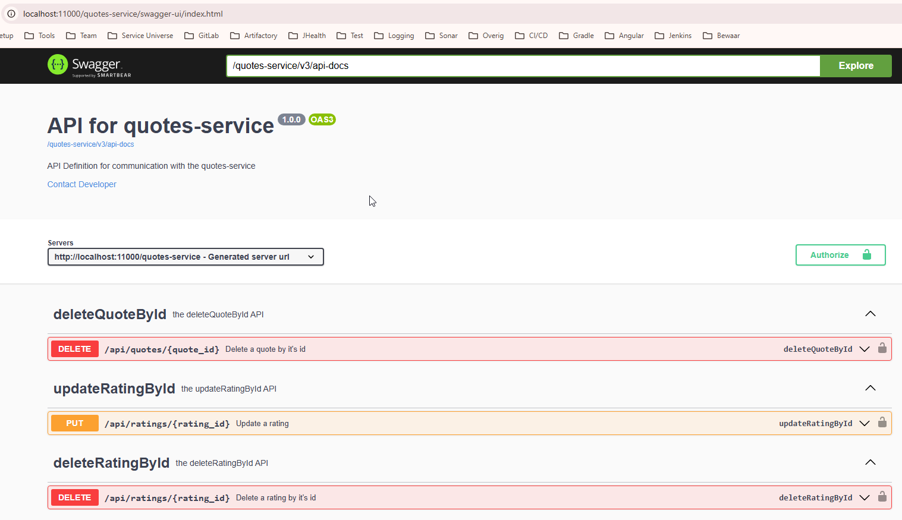
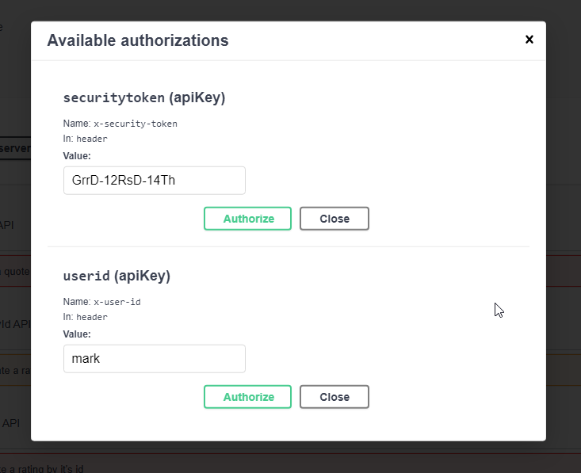
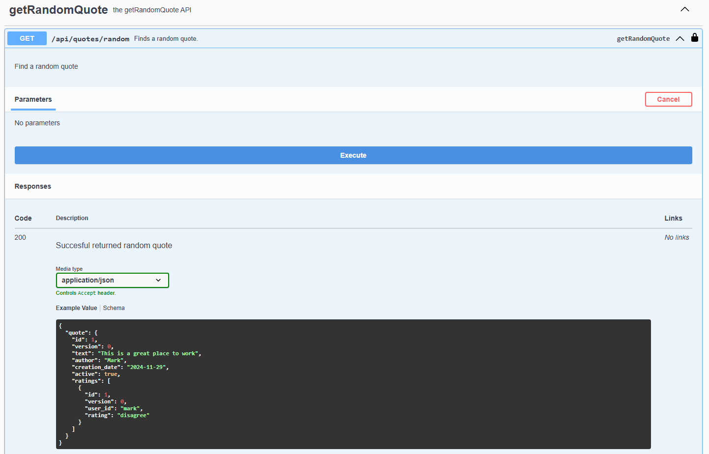
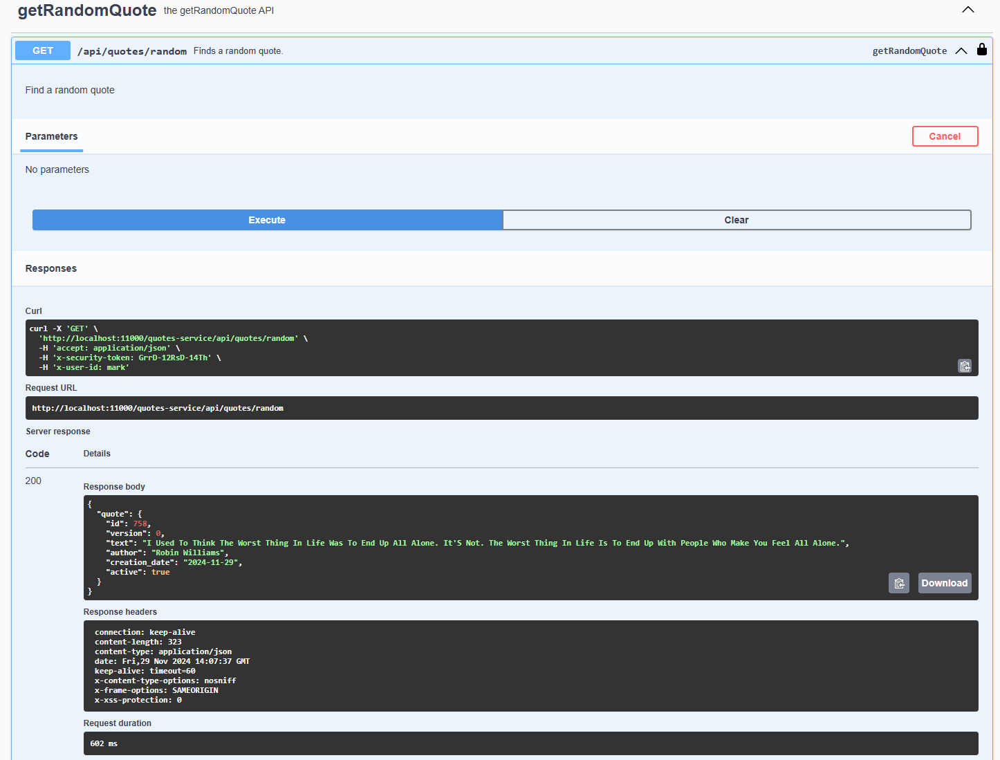

# quotes-project
backend coding assignment

# Table of Contents
- [The assignment](the-assignment)
- [Elaboration](elaboration)
- [Testing the assignment](testing-the-assignment)

## The assignment
Your assignment is to build a web service. The main API endpoint of your service should
display a random quote, retrieved from a remote source (for example
https://dummyjson.com/quotes or https://zenquotes.io/api/random). Every request should
respond with another random quote. All other requirements are up to you. Be as creative as
you like, impress us! In general try to approach this assignment as a production project
(within reason).

### Elaboration
I decided to go for a Springboot service with a rest api and json payload. The database is an in memory hsql database and
hibernate is used for persistence. To make the domain a little more complicated than just a Quote table it was made
possible to rate a quote. A logged-in user can rate a quote only once and can update or delete his own quotes and ratings.

the possible ratings are:
- agree
- neutral
- disagree

The random quote can be requested by calling the getRandomQuoteService.

There is a scheduler in the service that runs right after server startup and every day at 4 AM, in the morning.
Every time the scheduler runs a call is done to the dummyjson service to retrieve all quotes they have listed.
These quotes are added to the database if they are not yet added.

Apart from the scheduler it is also possible to add new quotes manually into the database.

There is no frontend implemented, I focussed on setting up a decent scalable and maintainable backend with as much
code generation as possible to keep things simple and clean. All generated boilerplate code is in the build folder.

code generation is done using:
- openapi
- mapstruct
- lombok

There are unit tests available. they are not complete yet, I focussed on showing different type of tests not on completeness.
Some will load the full context, others will use mockito.

There is also a mutation test task available. in a CI/CD pipeline I would also add things like Sonarqube and dependency check
to assure code quality.

### Projects
You will find these projects in this repository:
- dummyjson-external-api, containing api for calling dummyjson.com
- quotes-service-api, containing api for calling `quotes-service`
- quotes-service, service implementation containing assessment logic

## Testing the assignment
To run this project you have to follow these steps:

make sure you have these tools installed on your machine:
- Git
- Gradle
- Java 17

Make sure your proxy (if you are behind one) is configured in global gradle properties.

open a console or use eclipse or intellij.

clone the 2 git repositories for this assignment:
- git clone https://github.com/tufke/spring-boot-starter.git
- git clone https://github.com/tufke/quotes-project.git

build and publish the projects: gradlew publishToMavenLocal
1. from the root of the spring-boot-starter project
2. from the root of the dummyjson-external-api folder
3. from the root of the quotes-service-api folder
4. from the root of the quotes-service folder

The 3 submodules in the quotes-project are configured as composite projects meaning they could also be placed in their
own git repositories.

to run the service: gradlew bootrun
- from the root of the quotes-service folder

This will start a server at port 11000. open a browser and navigate to:
- http://localhost:11000/quotes-service

you will get redirected to the swagger-ui page that was included during the build of the service
available on /quotes-service/swagger-ui/index.html

in the top right corner you can click on the authorize button to enter needed request headers that should be available
in every rest call.

enter a securitytoken (anything will do for now) and enter an userid. Do not forget to push both `authorize` buttons

open GetRandomQuote and click on the `Try it out` button. You will see a big blue bar to execute a call to the getRandomQuote
endpoint. When you scroll down you will see some possible responses. the first one is an example of the success response
we want to see. press the blue execute bar.

After executing the getRadomQuote call you will see the json response in the black box. 
